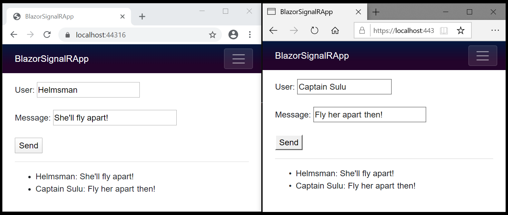

Lab: ASP.NET Core SignalR with Blazor
=====================================


In this lab
---------------

1.  Prerequisites
2.  Sample
    app
3.  Create a Blazor Server
    app
4.  Add the SignalR client
    library
5.  Add a SignalR
    hub
6.  Add services and an endpoint for the SignalR
    hub
7.  Add Razor component code for
    chat
8.  Run the
    app


This lab provides a basic working experience for building a
real-time app using SignalR with Blazor. This article is useful for
developers who are already familiar with SignalR and are seeking to
understand how to use SignalR in a Blazor app. For detailed guidance on
the SignalR and Blazor frameworks, see the following reference
documentation sets and the API documentation:

-   Overview of ASP.NET Core
    SignalR
-   ASP.NET Core
    Blazor
-   .NET API browser

Learn how to:


-   Create a Blazor app
-   Add the SignalR client library
-   Add a SignalR hub
-   Add SignalR services and an endpoint for the SignalR hub
-   Add a Razor component code for chat


At the end of this lab, you\'ll have a working chat app.


Create a hosted Blazor WebAssembly app
--------------------------------------


In a command shell, execute the following command:


``` 
dotnet new blazorwasm -ho -o BlazorWebAssemblySignalRApp

cd BlazorWebAssemblySignalRApp/
```

The `-ho|--hosted` option creates a hosted Blazor WebAssembly
[solution].
For information on configuring VS Code assets in the `.vscode` folder,
see the **Linux** operating system guidance in [Tooling for ASP.NET Core
Blazor].

The `-o|--output` option creates a folder for the solution. If you\'ve
created a folder for the solution and the command shell is open in that
folder, omit the `-o|--output` option and value to create the solution.

In Visual Studio Code, open the app\'s project folder.

Confirm that a hosted Blazor WebAssembly app was created: Confirm the
presence of a **[Client]** project and a
**[Server]** project in the app\'s
solution folder. If the two projects aren\'t present, start over and
confirm passing the `-ho` or `--hosted` option to the `dotnet new`
command when creating the solution.


Add the SignalR client library
------------------------------


In the **Integrated Terminal**, execute the following command:


``` 
dotnet add Client package Microsoft.AspNetCore.SignalR.Client
```

To add an earlier version of the package, supply the
`--version {VERSION}` option, where the `{VERSION}` placeholder is the
version of the package to add.


Add a SignalR hub
-----------------

In the `BlazorWebAssemblySignalRApp.Server` project, create a `Hubs`
(plural) folder and add the following `ChatHub` class
(`Hubs/ChatHub.cs`):


``` 
using Microsoft.AspNetCore.SignalR;

namespace BlazorWebAssemblySignalRApp.Server.Hubs;

public class ChatHub : Hub
{
    public async Task SendMessage(string user, string message)
    {
        await Clients.All.SendAsync("ReceiveMessage", user, message);
    }
}
```


Add services and an endpoint for the SignalR hub
------------------------------------------------

In the `BlazorWebAssemblySignalRApp.Server` project, open the
`Program.cs` file.

Add the namespace for the `ChatHub` class to the top of the file:

``` 
using BlazorWebAssemblySignalRApp.Server.Hubs;
```


Add SignalR and Response Compression Middleware services:


``` 
builder.Services.AddSignalR();
builder.Services.AddResponseCompression(opts =>
{
      opts.MimeTypes = ResponseCompressionDefaults.MimeTypes.Concat(
         new[] { "application/octet-stream" });
});
```

Use Response Compression Middleware at the top of the processing
pipeline\'s configuration immediately after the line that builds the
app:


``` 
app.UseResponseCompression();
```

Between the endpoints for controllers and the client-side fallback, add
an endpoint for the hub. Immediately after the line
`app.MapControllers();`, add the following line:


``` 
app.MapHub<ChatHub>("/chathub");
```


Add Razor component code for chat
---------------------------------


In the `BlazorWebAssemblySignalRApp.Client` project, open the
`Pages/Index.razor` file.

Replace the markup with the following code:


``` 
@page "/"
@using Microsoft.AspNetCore.SignalR.Client
@inject NavigationManager Navigation
@implements IAsyncDisposable

<PageTitle>Index</PageTitle>

<div class="form-group">
    <label>
        User:
        <input @bind="userInput" />
    </label>
</div>
<div class="form-group">
    <label>
        Message:
        <input @bind="messageInput" size="50" />
    </label>
</div>
<button @onclick="Send" disabled="@(!IsConnected)">Send</button>

<hr>

<ul id="messagesList">
    @foreach (var message in messages)
    {
        <li>@message</li>
    }
</ul>

@code {
    private HubConnection? hubConnection;
    private List<string> messages = new List<string>();
    private string? userInput;
    private string? messageInput;

    protected override async Task OnInitializedAsync()
    {
        hubConnection = new HubConnectionBuilder()
            .WithUrl(Navigation.ToAbsoluteUri("/chathub"))
            .Build();

        hubConnection.On<string, string>("ReceiveMessage", (user, message) =>
        {
            var encodedMsg = $"{user}: {message}";
            messages.Add(encodedMsg);
            StateHasChanged();
        });

        await hubConnection.StartAsync();
    }

    private async Task Send()
    {
        if (hubConnection is not null)
            {
                await hubConnection.SendAsync("SendMessage", userInput, messageInput);
            }
    }

    public bool IsConnected =>
        hubConnection?.State == HubConnectionState.Connected;

    public async ValueTask DisposeAsync()
    {
        if (hubConnection is not null)
        {
            await hubConnection.DisposeAsync();
        }
    }
}
```


Run the app
-----------

In a command shell from the `solution's` folder, execute the following commands:


``` 
cd Server
dotnet run
```


Important

When executing a hosted Blazor WebAssembly app, run the app from the
solution\'s **[Server]** project.

If the app fails to start in the browser:

-   In the .NET console, confirm that the solution is running from the "Server" project.
-   Refresh the browser using the browser\'s reload button.


Copy the URL from the address bar, open another browser instance or tab,
and paste the URL in the address bar.

Choose either browser, enter a name and message, and select the button
to send the message. The name and message are displayed on both pages
instantly:



